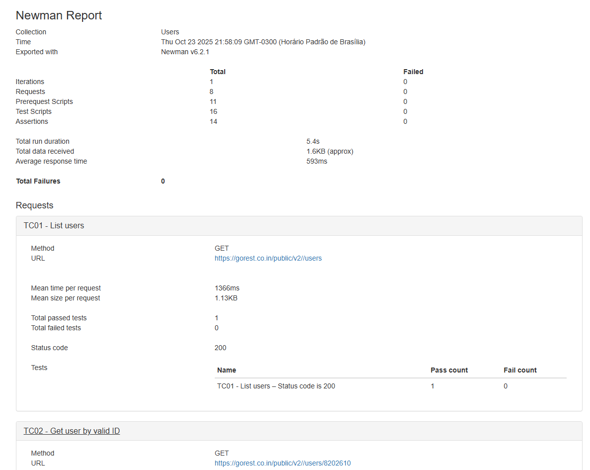
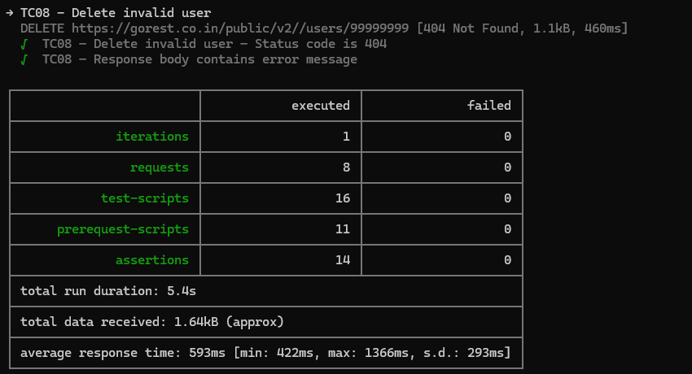
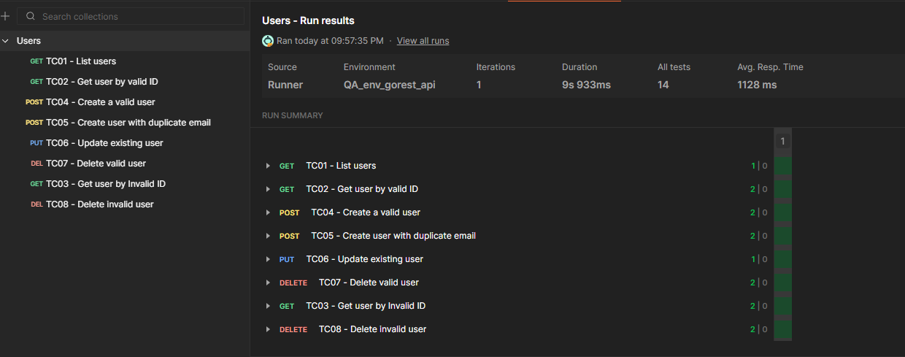

#  Projeto de Teste de API – GoRest

## 📋 Descrição do Projeto

O objetivo deste projeto é validar os principais endpoints do módulo **Users** da [GoRest API](https://gorest.co.in/), verificando se as operações de **CRUD (Create, Read, Update, Delete)** funcionam corretamente e seguem o contrato esperado.

O projeto foi totalmente construído no **Postman**, com uso do **Newman** para automação e geração de relatórios.  

---

## 🧾 Contexto e Cenário (História do Usuário)
O time de backend liberou uma nova versão da API pública do sistema, e como QA, você recebeu a tarefa de validar o endpoint de usuários (/users) da GoRest API.

**História do usuário:**

“Como administrador do sistema, quero criar, consultar, atualizar e deletar usuários via API, para garantir o gerenciamento correto de informações de clientes.”

## 🎯 Objetivos

- Validar o comportamento funcional dos endpoints de usuários;
- Garantir que as respostas da API estejam em conformidade com o esperado (status codes, payloads e mensagens de erro);
- Automatizar as verificações básicas via scripts no Postman;
- Gerar relatórios executivos para documentação e rastreabilidade.

---

## 🧱 Escopo Testado

Endpoints da GoRest API cobertos neste projeto:

| Método | Endpoint | Descrição |
|:--|:--|:--|
| GET | `/public/v2/users` | Listar todos os usuários |
| GET | `/public/v2/users/{id}` | Consultar usuário por ID |
| POST | `/public/v2/users` | Criar novo usuário |
| PUT | `/public/v2/users/{id}` | Atualizar usuário existente |
| DELETE | `/public/v2/users/{id}` | Deletar usuário existente |

---

## 🧩 Casos de Teste

| ID | Método | Endpoint | Cenário |Entrada| Resultado Esperado | Status Code|
|----|---------|-----------|----------|------|---------------------|--------|
| TC01 | GET | `/users` | Listar usuários | -- |Retorna lista de usuários | 200 |
| TC02 | GET | `/users/{id}` | Consultar usuário existente |id válido | Retorna dados válidos | 200 |
| TC03 | GET | `/users/{id}` | Consultar usuário inexistente |id inválido |Retorna erro 404 | 404 |
| TC04 | POST | `/users` | Criar usuário válido |JSON válido| Retorna 201 e dados criados | 201 |
| TC05 | POST | `/users` | Criar usuário com e-mail duplicado|JSON com e-mail existente | Retorna erro 422 | 422 |
| TC06 | PUT | `/users/{id}` | Atualizar usuário existente |JSON válido| Retorna 200 e dados atualizados | 200 |
| TC07 | DELETE | `/users/{id}` | Deletar usuário válido|id válido | Retorna 204 | 204 |
| TC08 | DELETE | `/users/{id}` | Deletar usuário inexistente|id inválido | Erro "Not Found" | 404 |
---

## ⚙️ Tecnologias e Ferramentas Utilizadas

- **Postman** – Criação e execução das requisições
- **Newman** – Execução em linha de comando e geração de relatórios
- **JavaScript (Postman Tests)** – Scripts de validação automatizados
- **JSON** – Estrutura de payload e validação de contrato

---

## 🔐 Autenticação

A API GoRest requer **autenticação via Bearer Token**.  
Você pode gerar um token pessoal gratuito em: [https://gorest.co.in/consumer/login](https://gorest.co.in/consumer/login)

No Postman, defina a variável de ambiente:
```
{{token}} = Bearer <seu_token_aqui>
```

---

## 🧰 Estrutura do Projeto

```
gorest_api/
│
├── Users.postman_collection.json                      # Coleção de requisições
├── QA_env_gorest_api.postman_environment.json         # Variáveis de ambiente
├── newman/report.html                                 # Relatório gerado via Newman
├── README.md                                          # Documentação do projeto
└── defects/                                           # Prints e logs (opcional)
```

---

## 🚀 Execução dos Testes

### 1️⃣ Importar e Executar no Postman
1. Importar a coleção `.json` no Postman  
2. Configurar a variável `{{base_url}} = https://gorest.co.in/public/v2`
3. Inserir o token em `{{token}}`
4. Executar as requisições manualmente ou via *Collection Runner*

---

### 2️⃣ Executar via Newman (CLI)
Instalar o **Newman**:
```bash
npm install -g newman
```

Executar a coleção:
```bash
newman run Users.postman_collection.json -e QA_env_gorest_api.postman_environment.json -r cli,html
```

Um relatório HTML será gerado (exemplo: `newman-report.html`), podendo ser aberto no navegador.

---

## 🧠 Exemplos de Scripts (Postman Tests)

### ✅ Verificação de status e campos obrigatórios
```js
pm.test("Status code é 200", function () {
    pm.response.to.have.status(200);
});

pm.test("Resposta contém campos esperados", function () {
    const jsonData = pm.response.json();
    pm.expect(jsonData[0]).to.have.property("name");
    pm.expect(jsonData[0]).to.have.property("email");
    pm.expect(jsonData[0]).to.have.property("id");
});
```

### ❌ Teste negativo (usuário inexistente)
```js
pm.test("Usuário inexistente retorna 404", function () {
    pm.response.to.have.status(404);
});
```

---

## 📊 Evidências e Relatórios

Os resultados foram registrados via **Newman**, gerando um relatório em HTML com:
- Total de casos executados;
- Percentual de sucesso/falha;
- Tempo de resposta médio;
- Logs de requisição e resposta.

---

### Exemplo de relatório:  


---

### Exemplo CLI Newman:


---

### Exemplo runner postman


---
## 📈 Conclusões

Este projeto demonstra a aplicação prática  de **API Testing com postman**:

- Criação de casos de teste estruturados;  
- Escrita de scripts de validação automatizados;  
- Utilização de ferramentas do ecossistema Postman/Newman;  
- Interpretação e documentação de resultados.

---

## 👤 Autor

**Lucas Ramalho do Nascimento**  
Analista de QA • Testes de API • Automação • Qualidade de Software  
📧 [lucasramalho.n@outlook.com](mailto:lucasramalho.n@outlook.com)  
🌐 [linkedin.com/in/lucasramalhon](https://www.linkedin.com/in/lucasramalhon/)  
💻 [github.com/Lucas-RNascimento](https://github.com/Lucas-RNascimento)
