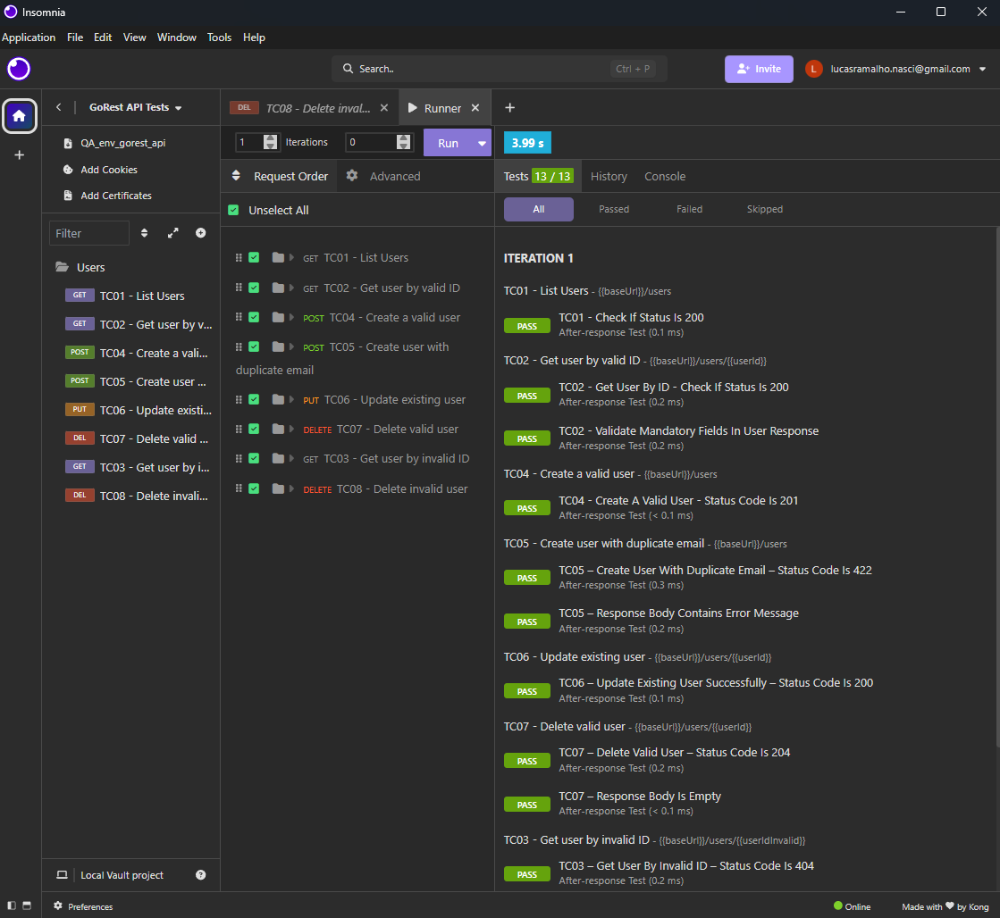

# Projeto de Teste de API – GoRest (Insomnia)

## 📋 Descrição do Projeto

O objetivo deste projeto é validar os principais endpoints do módulo **Users** da [GoRest API](https://gorest.co.in/), verificando se as operações de **CRUD (Create, Read, Update, Delete)** funcionam corretamente e seguem o contrato esperado.

O projeto foi totalmente construído no **Insomnia 11.6.2**, utilizando variáveis de ambiente, scripts de **Pre-request** e **Test Scripts** para automatizar validações.

---

## 🧾 Contexto e Cenário (História do Usuário)

O time de backend liberou uma nova versão da API pública do sistema, e como QA, você recebeu a tarefa de validar o endpoint de usuários (/users) da GoRest API.

**História do usuário:**

“Como administrador do sistema, quero criar, consultar, atualizar e deletar usuários via API, para garantir o gerenciamento correto de informações de clientes.”

---

## 🎯 Objetivos

- Validar o comportamento funcional dos endpoints de usuários;  
- Garantir que as respostas da API estejam em conformidade com o esperado (status codes, payloads e mensagens de erro);  
- Automatizar as verificações básicas via **Test Scripts** no Insomnia;  
- Manter rastreabilidade e reprodutibilidade dos testes.

---

## 🧱 Escopo Testado

Endpoints da GoRest API cobertos neste projeto:

| Método | Endpoint | Descrição |
|:--|:--|:--|
| GET | `/public/v2/users` | Listar todos os usuários |
| GET | `/public/v2/users/{id}` | Consultar usuário por ID |
| POST | `/public/v2/users` | Criar novo usuário |
| PUT | `/public/v2/users/{id}` | Atualizar usuário existente |
| DELETE | `/public/v2/users/{id}` | Deletar usuário existente |

---

## 🧩 Casos de Teste

| ID | Método | Endpoint | Cenário | Entrada | Resultado Esperado | Status Code |
|----|--------|-----------|---------|--------|------------------|------------|
| TC01 | GET | `/users` | Listar usuários | -- | Retorna lista de usuários | 200 |
| TC02 | GET | `/users/{id}` | Consultar usuário existente | id válido | Retorna dados válidos | 200 |
| TC03 | GET | `/users/{id}` | Consultar usuário inexistente | id inválido | Retorna erro 404 | 404 |
| TC04 | POST | `/users` | Criar usuário válido | JSON válido | Retorna 201 e dados criados | 201 |
| TC05 | POST | `/users` | Criar usuário com e-mail duplicado | JSON com e-mail existente | Retorna erro 422 | 422 |
| TC06 | PUT | `/users/{id}` | Atualizar usuário existente | JSON válido | Retorna 200 e dados atualizados | 200 |
| TC07 | DELETE | `/users/{id}` | Deletar usuário válido | id válido | Retorna 204 | 204 |
| TC08 | DELETE | `/users/{id}` | Deletar usuário inexistente | id inválido | Erro "Not Found" | 404 |

---

## ⚙️ Tecnologias e Ferramentas Utilizadas

- **Insomnia 11.6.2** – Criação e execução das requisições;  
- **JavaScript (Pre-request & Test Scripts)** – Scripts para automatizar validações e gerar variáveis de ambiente;  
- **JSON** – Estrutura de payload e validação de contrato.

---

## 🔐 Autenticação

A API GoRest requer **autenticação via Bearer Token**.  

- Gere um token pessoal gratuito em: [https://gorest.co.in/consumer/login](https://gorest.co.in/consumer/login)  
- No Insomnia, crie variáveis de ambiente:
    ```    
    {{token}} = Bearer <seu_token_aqui>

    {{base_url}} = https://gorest.co.in/public/v2
- Use essas variáveis nos headers e URLs das requisiões.


## 🧰 Estrutura do Projeto

```
gorest_insomnia/
│
├── GoRest.json # Export do Project/Collection do Insomnia (requests + environment)
├── README.md # Documentação do projeto
└── defects/ # Logs ou prints opcionais
```
Observação: no Insomnia, não é necessário exportar o Environment separadamente, pois ele já está incluído no arquivo .json.


## 🚀 Execução dos Testes
1️⃣ Importar e executar no Insomnia

Abra o Insomnia → Import Data → From File → selecione GoRest.json

Selecione o Project/Collection importado

Configure as variáveis de ambiente ({{token}}, {{base_url}})

Execute os requests manualmente ou use o Runner para execução sequencial

2️⃣ Visualizar resultados

Cada requisição exibe status code, corpo da resposta e Test Results

Os Test Scripts configurados validam automaticamente status codes, campos obrigatórios e valores retornados


## 📊 Evidências e Relatórios

No Insomnia, os resultados dos testes aparecem na aba Test Results

O Runner permite executar todos os requests sequencialmente

### Exemplo runner postman


## 📈 Conclusões

Este projeto demonstra a aplicação prática de API Testing com Insomnia:

Criação de requests estruturados para todos os endpoints CRUD;

Uso de Pre-request e Test Scripts para automatizar validações;

Utilização de variáveis de ambiente para tornar os testes reusáveis;

Facilidade de importar/exportar o projeto para colaboração e portfólio.

## 👤 Autor

**Lucas Ramalho do Nascimento**  
Analista de QA • Testes de API • Automação • Qualidade de Software  
📧 [lucasramalho.n@outlook.com](mailto:lucasramalho.n@outlook.com)  
🌐 [linkedin.com/in/lucasramalhon](https://www.linkedin.com/in/lucasramalhon/)  
💻 [github.com/Lucas-RNascimento](https://github.com/Lucas-RNascimento)
